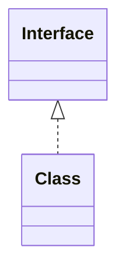

*Realisation* & *Implementation* of a class interface is an relationship that: 
- the class contains the methods of the interface



The differences between them is that: 
- Realisation maintains an "understanding" of the abstract interface WITHOUT code dependencies (*informal dependencies*; *class blueprint*)
- Implementation maintains dependencies by implementing the abstract interface

---
## Realisation Example

```python
class AbstractInterface(ABC):
	def method1(self):
		...

	def method2(self):
		...


class Realisation:
	def method1(self):
		...

	def method2(self):
		...
```


---
## Implementation Example

```python
class AbstractInterface(ABC):
	def method1(self):
		...

	def method2(self):
		...


class Implementation(AbstractInterface):
	def method1(self):
		...

	def method2(self):
		...
```


---
## ℹ️  Resources
- [Association, Aggregation, Composition, Abstraction, Generalization, Realization, Dependency - Javapapers](https://javapapers.com/oops/association-aggregation-composition-abstraction-generalization-realization-dependency/)